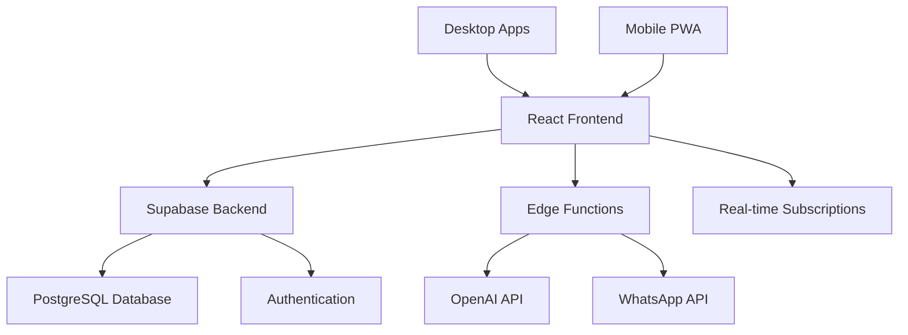

# TherapySync AI - Technical Documentation

[](https://github.com/your-org/therapysync-ai/actions)
[](https://www.typescriptlang.org/)
[](https://reactjs.org/)
[](https://supabase.com/)

## Overview

TherapySync AI is a comprehensive mental health and therapy platform that combines artificial intelligence, real-time communication, and evidence-based therapeutic approaches to provide personalized mental health support.

### Key Features

- **AI-Powered Therapy Chat** - Intelligent conversational therapy with multiple AI models
- **Crisis Detection & Intervention** - Real-time crisis detection with automatic escalation
- **Multi-Language Support** - Cultural awareness and international accessibility
- **WhatsApp Integration** - Seamless therapy conversations via WhatsApp
- **Family & Household Management** - Coordinated care for families
- **Real-Time Analytics** - Advanced insights and progress tracking
- **Progressive Web App** - Mobile-optimized experience with offline support
- **Desktop Applications** - Native apps for Windows, macOS, and Linux

## Architecture



## Quick Start

1. **Prerequisites**
   - Node.js 18+
   - npm or yarn
   - Supabase account

2. **Installation**
   ```bash
   git clone https://github.com/your-org/therapysync-ai.git
   cd therapysync-ai
   npm install
   ```

3. **Development**
   ```bash
   npm run dev
   ```

4. **Build Desktop Apps**
   ```bash
   npm run build:desktop
   ```

## Documentation Sections

### 📋 Core Documentation
- [System Architecture](./architecture/README.md) - Complete system design and data flows
- [Database Schema](./database/README.md) - Comprehensive database documentation
- [API Reference](./api/README.md) - All endpoints and edge functions

### 🛠 Development
- [Development Setup](./development/setup.md) - Local development environment
- [Component Library](./components/README.md) - React component documentation
- [Service Layer](./services/README.md) - Backend services and utilities
- [Testing Strategy](./development/testing.md) - Testing approaches and guidelines

### 🧠 AI & Intelligence
- [AI Models & Configuration](./ai/README.md) - AI model routing and configuration
- [Crisis Detection System](./ai/crisis-detection.md) - Emergency intervention protocols
- [Personalization Engine](./ai/personalization.md) - Adaptive therapy experiences
- [Notification Intelligence](./ai/notifications.md) - Smart notification system

### 🔒 Security & Compliance
- [Authentication System](./security/auth.md) - Supabase Auth implementation
- [Data Privacy](./security/privacy.md) - HIPAA compliance and data handling
- [Row Level Security](./security/rls.md) - Database security policies

### 🌐 Integrations
- [WhatsApp Integration](./integrations/whatsapp.md) - Messaging system setup
- [Third-party APIs](./integrations/apis.md) - External service integrations
- [Analytics Integration](./integrations/analytics.md) - Tracking and monitoring

### 📱 User Experience
- [Admin Dashboard](./ux/admin.md) - Administrative features
- [Mobile Optimization](./ux/mobile.md) - PWA and responsive design
- [Accessibility](./ux/accessibility.md) - A11y compliance features

### 🚀 Deployment
- [GitHub Actions](./deployment/github-actions.md) - CI/CD workflows
- [Desktop Builds](./deployment/desktop.md) - Electron app distribution
- [Environment Configuration](./deployment/environment.md) - Secrets and configuration

## Technology Stack

| Category | Technology | Purpose |
|----------|------------|---------|
| **Frontend** | React 18 + TypeScript | User interface and interactions |
| **Styling** | Tailwind CSS + Shadcn/ui | Design system and components |
| **Backend** | Supabase | Database, auth, and real-time features |
| **Database** | PostgreSQL | Data persistence and relationships |
| **AI/ML** | OpenAI GPT-4 | Conversational AI and analysis |
| **Build Tool** | Vite | Fast development and building |
| **Desktop** | Electron | Cross-platform desktop applications |
| **Communication** | WhatsApp Business API | External messaging integration |
| **Monitoring** | Custom Analytics | User behavior and system metrics |

## Project Statistics

- **Components**: 400+ React components
- **Services**: 30+ backend services
- **Database Tables**: 100+ tables with comprehensive relationships
- **Edge Functions**: 25+ Supabase edge functions
- **Languages**: 12+ supported languages
- **Platforms**: Web, Desktop (Win/Mac/Linux), Mobile PWA

## Support & Contributing

- **Issues**: [GitHub Issues](https://github.com/your-org/therapysync-ai/issues)
- **Discussions**: [GitHub Discussions](https://github.com/your-org/therapysync-ai/discussions)
- **Contributing**: See [CONTRIBUTING.md](../CONTRIBUTING.md)
- **License**: [MIT License](../LICENSE)

## Emergency Contacts

For crisis-related issues or security vulnerabilities:
- **Crisis Support**: [Crisis Management Protocol](./security/crisis-protocol.md)
- **Security Issues**: security@therapysync.ai
- **Technical Support**: support@therapysync.ai

---

*Last Updated: January 2025*