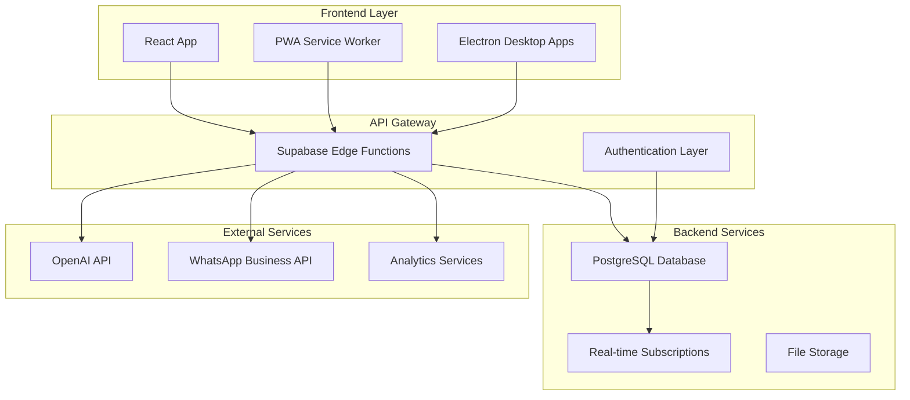
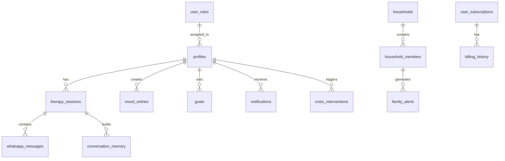
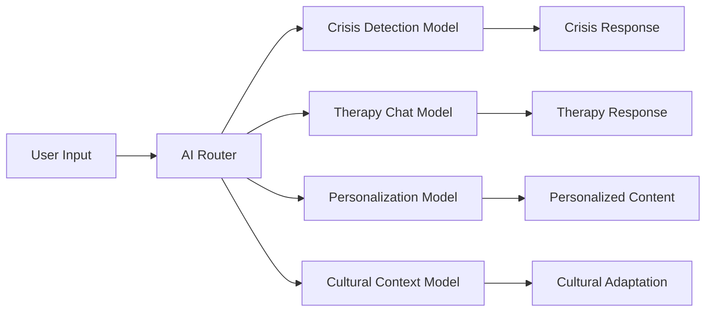
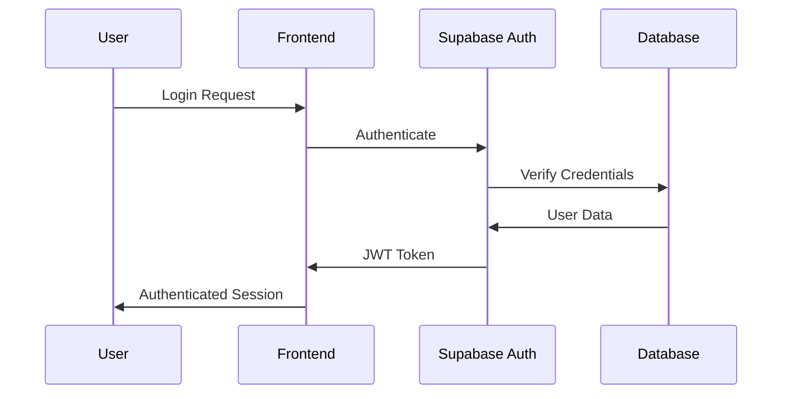
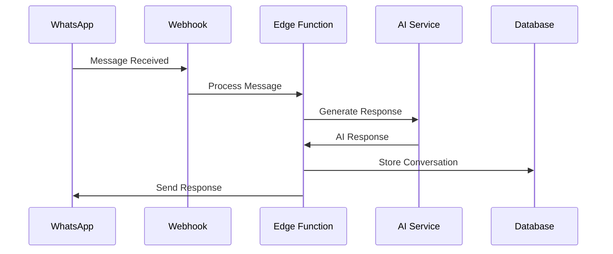
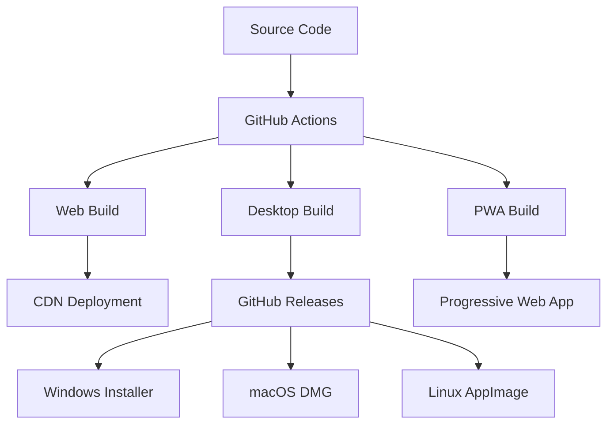

# System Architecture

## Overview

TherapySync AI follows a modern, scalable architecture combining a React frontend with Supabase backend services, integrated AI capabilities, and real-time communication features.

## High-Level Architecture



## Component Architecture

### Frontend Components (400+)

```
src/components/
├── admin/                    # Administrative interfaces
│   ├── analytics/           # Analytics dashboards
│   ├── ai/                  # AI configuration
│   ├── users/               # User management
│   └── system/              # System monitoring
├── ai/                      # AI-related components
│   ├── chat/                # Therapy chat interfaces
│   ├── personalization/     # AI personalization
│   └── recommendations/     # AI recommendations
├── auth/                    # Authentication components
├── crisis/                  # Crisis detection & management
├── dashboard/               # User dashboard components
├── integrations/            # Third-party integrations
├── mobile/                  # Mobile-specific components
├── notifications/           # Notification system
├── session/                 # Therapy session management
├── voice/                   # Voice interaction components
└── ui/                      # Base UI components (Shadcn)
```

## Service Layer Architecture

### Backend Services (30+)

```
src/services/
├── aiService.ts                    # Core AI functionality
├── crisisDetectionService.ts       # Crisis detection & intervention
├── notificationService.ts          # Intelligent notifications
├── voiceCloneService.ts            # Voice cloning capabilities
├── culturalContextService.ts       # Cultural awareness
├── personalizationService.ts       # User personalization
├── sessionService.ts               # Therapy session management
├── analyticsService.ts             # User behavior analytics
├── securityService.ts              # Security monitoring
└── integrationServices/            # External service integrations
```

## Database Architecture

### Core Tables Structure



## Real-Time Architecture

### Supabase Realtime Integration

```typescript
// Real-time subscriptions for live features
const subscriptions = {
  therapySessions: supabase
    .channel('therapy-sessions')
    .on('postgres_changes', 
        { event: '*', schema: 'public', table: 'therapy_sessions' },
        handleSessionUpdate),
        
  crisisAlerts: supabase
    .channel('crisis-alerts')
    .on('postgres_changes',
        { event: 'INSERT', schema: 'public', table: 'crisis_interventions' },
        handleCrisisAlert),
        
  notifications: supabase
    .channel('notifications')
    .on('postgres_changes',
        { event: 'INSERT', schema: 'public', table: 'notifications' },
        handleNotification)
};
```

## AI Model Routing

### Multi-Model AI Architecture



### AI Service Configuration

```typescript
interface AIModelConfig {
  primaryModel: 'gpt-4' | 'gpt-4-turbo' | 'gpt-3.5-turbo';
  crisisModel: 'gpt-4' | 'specialized-crisis';
  culturalModel: 'culturally-aware-gpt';
  fallbackModel: 'gpt-3.5-turbo';
  routing: {
    crisisThreshold: number;
    culturalContextThreshold: number;
    personalizationLevel: 'basic' | 'advanced' | 'expert';
  };
}
```

## Security Architecture

### Row Level Security (RLS)

```sql
-- Example RLS policy structure
CREATE POLICY "Users can only access their own data"
ON public.therapy_sessions
FOR ALL USING (auth.uid() = user_id);

CREATE POLICY "Crisis interventions viewable by user and admins"
ON public.crisis_interventions
FOR SELECT USING (
  auth.uid() = user_id OR 
  is_admin(auth.uid())
);
```

### Authentication Flow



## Integration Architecture

### WhatsApp Integration Flow



## Performance Architecture

### Caching Strategy

```typescript
interface CacheStrategy {
  userSessions: 'redis' | 'memory' | 'localStorage';
  aiResponses: 'database' | 'redis';
  staticContent: 'cdn' | 'serviceWorker';
  analytics: 'batched' | 'realtime';
}
```

### Load Balancing & Scaling

- **Frontend**: CDN distribution with edge caching
- **API**: Supabase auto-scaling edge functions
- **Database**: Read replicas for analytics queries
- **AI**: Model routing based on load and complexity

## Monitoring & Observability

### System Health Monitoring

```typescript
interface MonitoringMetrics {
  frontend: {
    loadTime: number;
    errorRate: number;
    userEngagement: MetricData;
  };
  backend: {
    responseTime: number;
    throughput: number;
    errorRate: number;
  };
  ai: {
    modelLatency: number;
    tokenUsage: number;
    qualityScore: number;
  };
  crisis: {
    detectionAccuracy: number;
    responseTime: number;
    interventionSuccess: number;
  };
}
```

## Deployment Architecture

### Multi-Platform Deployment



## Scalability Considerations

### Horizontal Scaling Points

1. **Edge Functions**: Auto-scaling based on demand
2. **Database**: Connection pooling and read replicas
3. **AI Services**: Multiple model endpoints with load balancing
4. **File Storage**: CDN integration for global distribution
5. **Real-time**: Channel-based scaling for concurrent users

### Performance Targets

- **Page Load**: < 2 seconds initial load
- **AI Response**: < 3 seconds for therapy chat
- **Crisis Detection**: < 1 second for analysis
- **Real-time Updates**: < 100ms latency
- **Mobile Performance**: Lighthouse score > 90

---

*Architecture subject to continuous improvement based on usage patterns and performance metrics.*